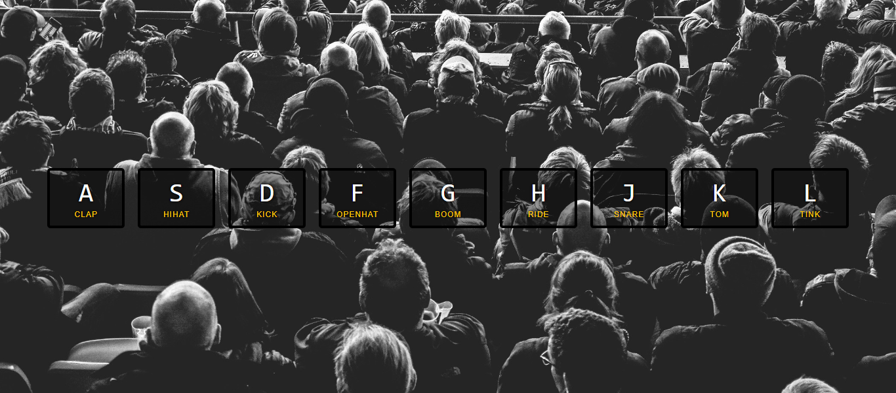

# Drum-Kit

## Table of contents

- [Overview](#overview)
  - [Description](#description)
  - [Screenshot](#screenshot)
  - [Links](#links)
- [My Process](#my-process)
  - [Built with](#built-with)
  - [What I Learned](#what-i-learned)
  - [Continued development](#continued-development)
  - [Useful resources](#useful-resources)
- [Author](#author)

## Overview

### Description

This website provides a number of keys on the webpage that represents the different drums in a
typical drum set and you can use the corresponding keys on the keyboard to get a sound effect.

### Screenshot

### Links

Live Site URL: https://shubhamkumar3110.github.io/Drum-Kit/

## My Process

### Built with

- HTML
- CSS
- JavaScript

### What I Learned

I learned that we can use custom data- attributes for any element and associate that element with our desired information that we can later access or manipulate with javascript or use it in the CSS as an attribute selector.

### Continued development

I will be focusing on building responsive web pages.

### Useful resources

[Wes Bos](https://wesbos.com/) - I followed the tutorials provided by Wes Bos. He teaches a lot of simple projects focused on JavaScript.

## Author
Shubham Kumar
